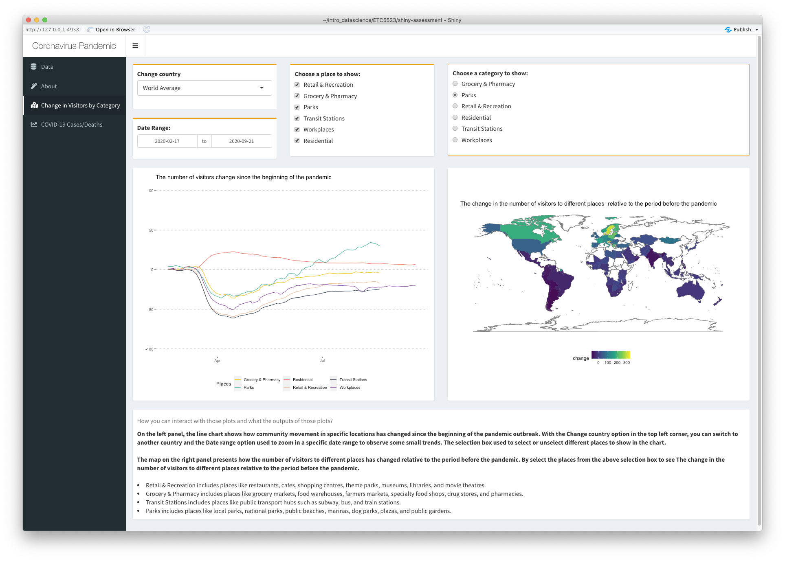

<!-- README.md is generated from README.Rmd. Please edit that file -->

```{r, include = FALSE}
knitr::opts_chunk$set(
  collapse = TRUE,
  comment = "#>",
  fig.path = "man/figures/README-",
  out.width = "80%", 
  fig.align='center'
)
```

# COVID19dashboard

<!-- badges: start -->
[](https://github.com/etc5523-2020/r-package-assessment-YIWEN-JIANG-github/actions)
[](https://www.gnu.org/licenses/gpl-3.0)
[](https://github.com/etc5523-2020/r-package-assessment-YIWEN-JIANG-github/commit/master) 
<!-- badges: end -->

## Overview

The goal of COVID19dashboard package is to provide datasets and functions to run the COVID-19 shiny dashboard.

The COVID-19 shiny dashboard, first launched on Oct 2020, aims to complement existing COVID-19 mapping dashboards (such as those developed by the [WHO](https://covid19.who.int/)) with several interactive features, including the timeline function and the ability to compare between countries.

## Installation

The development version can be installed from [GitHub](https://github.com/) with:

``` r
# install.packages("devtools")
devtools::install_github("etc5523-2020/r-package-assessment-YIWEN-JIANG-github")
```
## Get started

The data set records COVID-19 information since Dec 31, 2019, and provided by [Our World in Data](https://ourworldindata.org/coronavirus). 

The package includes three data, which are `covid_raw`, `visitor_map` and `visitors_total`.  

* `covid_raw`: The data comes from covid_raw.rda. The data contains the COVID-19 information of 210 countries since Dec 31, 2019.  
* `visitors_total`: The data comes from visitors_total.rda. The data contains information on how the number of visitors changes sine pandemic for different places.  
* `visitor_map`:  The data comes from visitor_map.rda. The data added geometric information compare to `visitors_total`, it can be used to create a map plot.    

## Shiny interface (How to run the app)

By using the `launch_app()` function to run the shiny dashboard. This app aims to complement the raw data by providing interactive visualisation and used to compare the difference between the countries. 

```{r launch-shiny-app, eval=FALSE}
launch_app()
```

A screenshot of the interface is provided below.



## Example

This is a basic example which shows you the COVID-19 data in this package:

```{r example}
library(COVID19dashboard)
library(tibble)
covid_raw
```

There are four functions inside this package, which are:

- `launch_app()`: Launch the COVID-19 shiny dashboard  
- `add_comma()`: Label numbers in decimal format (e.g. 1,234)  
- `shiny_note()`: Add a note box into shiny app  
- `date_range()`: Create date range input  

### Plotting the number of daily new cases in the United States

```{r usa-daily-new-cases}
library(tidyverse)
covid_raw %>%
  dplyr::filter(location == "United States") %>%
  ggplot() +
  geom_line(aes(x = date, y = new_cases)) +
  theme_classic() +
  ylab("Number of Daily New Cases") +
  xlab("Date") +
  ggtitle("Number of Daily New Cases in United States")
```

## Data Source

- Our World in Data: https://ourworldindata.org/coronavirus
- Google Community Mobility Reports: https://www.google.com/covid19/mobility/