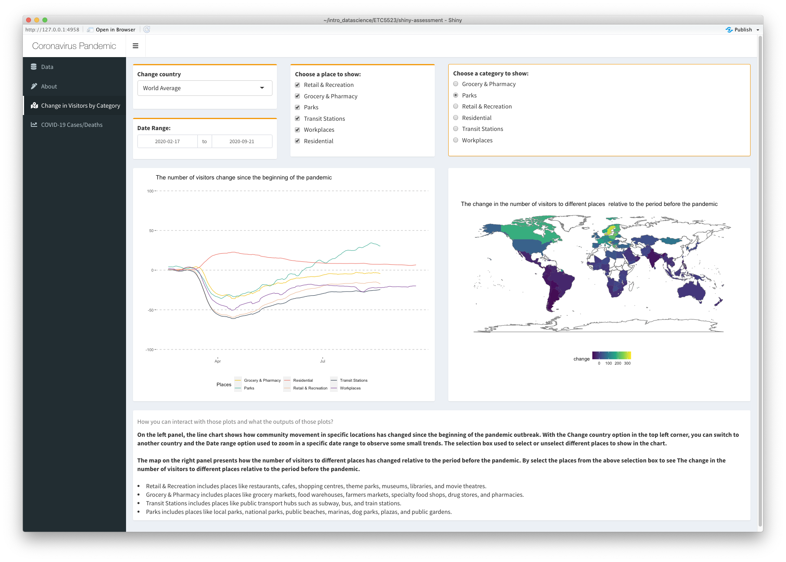
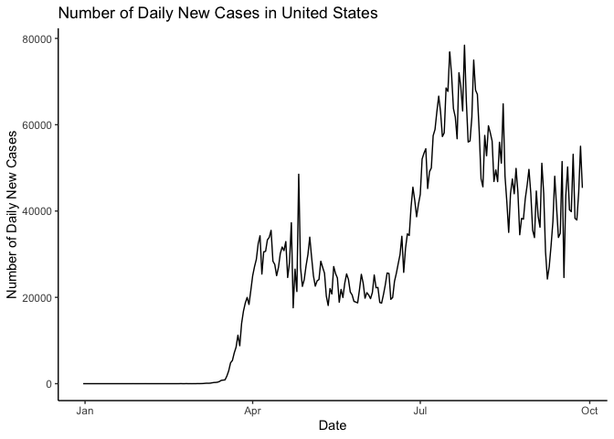

<!-- README.md is generated from README.Rmd. Please edit that file -->

# COVID19dashboard

<!-- badges: start -->

[](https://github.com/etc5523-2020/r-package-assessment-YIWEN-JIANG-github/actions)
[](http://www.gnu.org/licenses/gpl-3.0.en.html)
[](https://github.com/etc5523-2020/r-package-assessment-YIWEN-JIANG-github/commit/master)
<!-- badges: end -->

## Overview

The goal of COVID19dashboard is to provides datasets and functions for
run the COVID-19 shiny dashboard.

The Shiny app, first launched on Oct 2020, aims to complement existing
COVID-19 mapping dashboards (such as those developed by the
[WHO](https://covid19.who.int/)) with several interactive features,
including the timeline function and the ability to compare between
countries.

## Installation

The development version can be installed from
[GitHub](https://github.com/) with:

``` r
# install.packages("devtools")
devtools::install_github("etc5523-2020/r-package-assessment-YIWEN-JIANG-github")
```

## Get started

The data set records COVID-19 information since Dec 31, 2019 and
provided by [Our World in Data](https://ourworldindata.org/coronavirus).

The package include three data, which are `covid_raw`, `visitor_map` and
`visitors_total`.

  - `covid_raw`: The data comes from covid\_raw.rda. The data contains
    the COVID-19 information OF 210 countries since Dec 31, 2019.  
  - `visitors_total`: The data comes from visitors\_total.rda. The data
    contains the information how the number of visitors change sine
    pandemic for different places.  
  - `visitor_map`: The data comes from visitor\_map.rda. The data added
    geometric information compare to `visitors_total`, it can be used to
    create map plot.

## Shiny interface (How to run the app)

By using the `launch_app()` function to run the shiny dashboard. The aim
of this app is to complement the raw data by providing interactive
visualisation, and used to compare the difference between the countries.

``` r
launch_app()
```

A screenshot of the interface is provided below.



## Example

This is a basic example which shows you the COVID-19 data in this
package:

``` r
library(COVID19dashboard)
#> Loading required package: shiny
#> Loading required package: tibble
#> Loading required package: shinydashboard
#> 
#> Attaching package: 'shinydashboard'
#> The following object is masked from 'package:graphics':
#> 
#>     box
library(tibble)
covid_raw
#> # A tibble: 46,484 x 41
#>    iso_code continent location date       total_cases new_cases new_cases_smoot…
#>    <chr>    <chr>     <chr>    <date>           <dbl>     <dbl>            <dbl>
#>  1 AFG      Asia      Afghani… 2019-12-31           0         0               NA
#>  2 AFG      Asia      Afghani… 2020-01-01           0         0               NA
#>  3 AFG      Asia      Afghani… 2020-01-02           0         0               NA
#>  4 AFG      Asia      Afghani… 2020-01-03           0         0               NA
#>  5 AFG      Asia      Afghani… 2020-01-04           0         0               NA
#>  6 AFG      Asia      Afghani… 2020-01-05           0         0               NA
#>  7 AFG      Asia      Afghani… 2020-01-06           0         0                0
#>  8 AFG      Asia      Afghani… 2020-01-07           0         0                0
#>  9 AFG      Asia      Afghani… 2020-01-08           0         0                0
#> 10 AFG      Asia      Afghani… 2020-01-09           0         0                0
#> # … with 46,474 more rows, and 34 more variables: total_deaths <dbl>,
#> #   new_deaths <dbl>, new_deaths_smoothed <dbl>, total_cases_per_million <dbl>,
#> #   new_cases_per_million <dbl>, new_cases_smoothed_per_million <dbl>,
#> #   total_deaths_per_million <dbl>, new_deaths_per_million <dbl>,
#> #   new_deaths_smoothed_per_million <dbl>, new_tests <lgl>, total_tests <lgl>,
#> #   total_tests_per_thousand <lgl>, new_tests_per_thousand <lgl>,
#> #   new_tests_smoothed <lgl>, new_tests_smoothed_per_thousand <lgl>,
#> #   tests_per_case <lgl>, positive_rate <lgl>, tests_units <lgl>,
#> #   stringency_index <dbl>, population <dbl>, population_density <dbl>,
#> #   median_age <dbl>, aged_65_older <dbl>, aged_70_older <dbl>,
#> #   gdp_per_capita <dbl>, extreme_poverty <dbl>, cardiovasc_death_rate <dbl>,
#> #   diabetes_prevalence <dbl>, female_smokers <dbl>, male_smokers <dbl>,
#> #   handwashing_facilities <dbl>, hospital_beds_per_thousand <dbl>,
#> #   life_expectancy <dbl>, human_development_index <dbl>
```

There are four functions inside this package, which are:

  - `launch_app()`: Launch the COVID-19 shiny dashboard  
  - `add_comma()`: Label numbers in decimal format (e.g. 1,234)  
  - `shiny_note()`: Add a note box into shiny app  
  - `date_range()`: Create date range input

### Plotting the active cases distribution

``` r
library(tidyverse)
#> ── Attaching packages ─────────────────────────────────────── tidyverse 1.3.0 ──
#> ✓ ggplot2 3.3.2     ✓ dplyr   1.0.2
#> ✓ tidyr   1.1.2     ✓ stringr 1.4.0
#> ✓ readr   1.4.0     ✓ forcats 0.5.0
#> ✓ purrr   0.3.4
#> ── Conflicts ────────────────────────────────────────── tidyverse_conflicts() ──
#> x dplyr::filter() masks stats::filter()
#> x dplyr::lag()    masks stats::lag()
covid_raw %>%
  dplyr::filter(location == "United States") %>%
  ggplot() +
  geom_line(aes(x = date, y = new_cases)) +
  theme_classic() +
  ylab("Number of Daily New Cases") +
  xlab("Date") +
  ggtitle("Number of Daily New Cases in United States")
```


